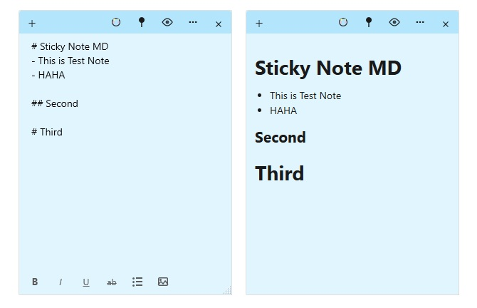
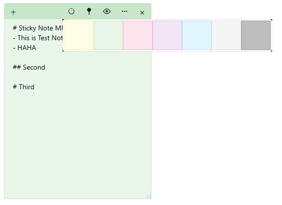

# Sticky Note MD

A Windows Sticky Notes clone with Markdown support, built with WPF (.NET 8).

## Motivation

I wanted to use Markdown in Windows Sticky Notes, but the built-in Sticky Notes app doesn't support this feature. After searching for existing solutions, I couldn't find any properly implemented projects that met my needs. So I decided to build a simple implementation myself.

## Features

- **Markdown Support**: Write in Markdown and preview rendered output
- **WYSIWYG Editing**: Bold, Italic, Underline, Strikethrough formatting with real-time visual feedback
- **Multiple Notes**: Create and manage multiple sticky notes independently
- **Color Themes**: 7 color options (Yellow, Green, Pink, Purple, Blue, Gray, Dark Gray)
- **Always on Top**: Pin notes to stay on top of other windows
- **Auto Save**: Notes are automatically saved as you type
- **Persistent Storage**: Notes and colors are preserved between sessions

## Screenshots

### Edit Mode & Markdown Preview


### Color Themes


## Requirements

- Windows 10/11
- .NET 8.0 Runtime
- WebView2 Runtime (for Markdown preview)

## Installation

### Option 1: Build from Source

```bash
git clone https://github.com/WhalePrompt/sticky-note-md.git
cd sticky-note-md
dotnet build -c Release
```

The executable will be in `bin/Release/net8.0-windows/`

### Option 2: Download Release

Download the latest release from the [Releases](https://github.com/WhalePrompt/sticky-note-md/releases) page.

## Usage

- **New Note**: Click the `+` button in the title bar
- **Color**: Click the palette icon to change note color
- **Pin**: Click the pin icon to toggle always-on-top
- **Preview**: Click the eye icon or press `Ctrl+P` to toggle Markdown preview
- **Formatting**:
  - `Ctrl+B`: Bold
  - `Ctrl+I`: Italic
  - `Ctrl+U`: Underline
  - `Ctrl+S`: Save

## Data Storage

Notes are stored in:
```
%APPDATA%\StickyNoteMD\notes\
```

Each note is saved as:
- `{note-id}.md` - Note content in Markdown format
- `{note-id}.color` - Note color preference

## Tech Stack

- **Framework**: WPF (.NET 8)
- **Markdown Parser**: [Markdig](https://github.com/xoofx/markdig)
- **Preview Renderer**: WebView2

## License

MIT License

## Contributing

Contributions are welcome! Feel free to submit issues and pull requests.
